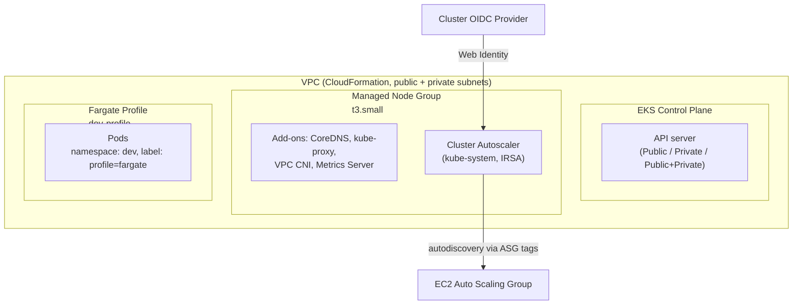

# EKS Cluster Setup — AWS

> **FR** — Mise en place complète d'un cluster Amazon EKS : réseau (VPC CloudFormation), rôles IAM, add-ons, node groups managés, autoscaling automatique via Cluster Autoscaler (OIDC/IRSA), Fargate, et provisionnement reproductible avec eksctl.
>
> **EN** — End-to-end setup of an Amazon EKS cluster: VPC networking (CloudFormation), IAM roles, cluster add-ons, managed node groups, automatic scaling with Cluster Autoscaler (OIDC/IRSA), Fargate serverless pods, and reproducible provisioning with eksctl.


---

## Problem

An EKS cluster clicked together in the console works exactly once — it isn't reproducible, isn't reviewable, and hides the IAM/OIDC/networking decisions that actually make the cluster secure or not. But jumping straight to `eksctl create cluster` without first understanding what that one command provisions underneath is how you end up unable to debug it when it doesn't come up cleanly. This project builds the cluster manually first, then automates it, deliberately in that order.

## Solution

The cluster is built up layer by layer: an official EKS-tagged VPC (public + private subnets, required for load balancer and node placement), a control-plane IAM role distinct from the worker role, the managed node group, and the core add-ons (CoreDNS, kube-proxy, VPC CNI, Metrics Server). On top of that, **Cluster Autoscaler** is wired through IRSA so it can call the Auto Scaling API without static credentials, and a **Fargate profile** demonstrates running serverless pods alongside the managed nodes in the same namespace. The final section replaces every manual step with a single reproducible `eksctl create cluster -f cluster.yaml`.

## Architecture



## Skills demonstrated

- Understanding *why* EKS needs a purpose-built VPC (subnet tags, AZ spread) rather than reusing the account's default VPC
- Distinguishing control-plane IAM permissions from worker-node IAM permissions, and knowing why they must not be the same role
- IRSA setup end to end: OIDC provider registration, Web Identity IAM role, ASG autodiscovery tags, `safe-to-evict` annotation to protect the autoscaler from evicting itself
- Fargate profile selector design (namespace + label) to mix Fargate and EC2-backed pods in the same namespace without conflict
- Choosing eksctl for reproducibility once the manual model is understood, instead of treating it as a black box from the start

## Key technical decisions

| Decision | Why |
|---|---|
| Official EKS CloudFormation VPC template over the account default VPC | EKS requires specific subnet tags and public/private separation that the default VPC doesn't provide. |
| Separate IAM roles for control plane and workers | The control plane role lets AWS provision load balancers and security groups on your behalf; conflating it with the worker role over-grants both. |
| IRSA over static IAM credentials for the autoscaler | No long-lived AWS secret needs to exist inside the cluster; the Web Identity role is scoped to `autoscaling:*` and `ec2:Describe*` only. |
| `eksctl` config file over ad-hoc CLI flags | A YAML cluster definition is versionable and reviewable, unlike a one-off command with a dozen flags. |

## Limitations

- The console-based setup (this project's starting point) is inherently non-reproducible — only the `eksctl` config at the end is.
- Autoscaler behavior was validated manually (20 replicas → 3 nodes → back to 1 in ~10 min) rather than under a sustained load test.
- No Terraform/IaC layer yet — `eksctl` is the current reproducibility mechanism, not a full state-managed IaC tool.

## Roadmap

- [ ] Replace the `eksctl` cluster definition with a Terraform module (VPC, IAM, EKS, node group) for full state management
- [ ] Add a load test (e.g. `k6` or a batch Job) to validate autoscaler behavior under sustained, not just burst, load

---

## FR — Détails d'implémentation

### Création du cluster

IAM Role control plane, VPC via template CloudFormation officiel (subnets publics + privés), cluster EKS, node group managé `t3.small`, kubeconfig local. Le rôle IAM du control plane est distinct de celui des workers — il donne à AWS les droits de provisionner les composants du cluster (load balancers, security groups) en votre nom. L'API server propose trois modes d'accès (Public / Private / Public+Private) avec des compromis sécurité / opérabilité différents. Add-ons activés : CoreDNS, kube-proxy, VPC CNI, Metrics Server, EKS Pod Identity Agent.

### Cluster Autoscaler

IAM Policy + IAM Role Web Identity (OIDC), OIDC provider, déploiement Cluster Autoscaler dans `kube-system`. Les Service Accounts Kubernetes ne sont pas des entités IAM, OIDC sert de pont entre les deux. Deux tags doivent être présents sur le ASG pour l'autodiscovery : `k8s.io/cluster-autoscaler/enabled` et `k8s.io/cluster-autoscaler/<cluster-name>`. L'annotation `safe-to-evict: "false"` empêche l'autoscaler de s'évincer lui-même lors d'un scale-down. Testé : 20 réplicas → 3 nœuds EC2, puis retour à 1 nœud en ~10 minutes.

### Fargate

IAM Role pod execution, Fargate Profile `dev-profile` (namespace + label selectors), namespace `dev`. Fargate remplace les EC2 workers par 1 VM isolée par pod, gérée par AWS en dehors du compte client. Le Fargate Profile définit les règles de sélection (namespace + labels) : les pods du namespace `dev` ne sont schedulés sur Fargate que si le label correspond, ce qui permet de mixer Fargate et EC2 dans le même namespace.

### eksctl

Un seul `eksctl create cluster` crée VPC, subnets, IAM roles, control plane, node group et kubeconfig. Alternative : un fichier YAML config (`eksctl create cluster -f cluster.yaml`) pour une définition reproductible et versionnée.

## EN — Implementation Details

### Console cluster setup

IAM Role for the control plane, VPC via the official CloudFormation template (public + private subnets), EKS cluster, managed `t3.small` node group, local kubeconfig. The control plane IAM role is separate from the worker node role — it lets AWS provision cluster components (load balancers, security groups) on your behalf. The API server has three access modes (Public / Private / Public+Private) with different security and operational trade-offs. Add-ons: CoreDNS, kube-proxy, VPC CNI, Metrics Server, EKS Pod Identity Agent.

### Cluster Autoscaler

IAM Policy + IAM Role (Web Identity / OIDC), OIDC provider, Cluster Autoscaler deployment in `kube-system`. Kubernetes Service Accounts are not IAM entities — OIDC bridges that gap. Two ASG tags are required for autodiscovery: `k8s.io/cluster-autoscaler/enabled` and `k8s.io/cluster-autoscaler/<cluster-name>`. The `safe-to-evict: "false"` annotation prevents the autoscaler from evicting itself during scale-down. Tested: 20 replicas scaled up to 3 EC2 nodes, then back to 1 node in ~10 minutes.

### Fargate

Fargate pod execution IAM Role, `dev-profile` Fargate Profile (namespace + label selectors), `dev` namespace. Fargate replaces EC2 worker nodes with 1 isolated VM per pod, managed by AWS outside your account. The Fargate Profile sets the selection rules (namespace + labels): pods in the `dev` namespace are only scheduled on Fargate when the label matches, which allows mixing Fargate and EC2 pods in the same namespace.

### eksctl

A single `eksctl create cluster` creates VPC, subnets, IAM roles, control plane, node group, and kubeconfig. The YAML config alternative (`eksctl create cluster -f cluster.yaml`) gives a reproducible, version-controlled cluster definition.

---

## Prerequisites

- An AWS account with IAM rights to create VPCs, EKS clusters, IAM roles and OIDC providers
- `eksctl`, `kubectl`, `aws-cli`

## Project Structure

```
.
├── eksctl/
│   └── cluster.yaml              # Reproducible cluster definition (eksctl create cluster -f)
└── manifests/
    ├── cluster-autoscaler.yaml   # Cluster Autoscaler Deployment (IRSA-authenticated)
    └── nginx.yaml                # Sample workload used to trigger/validate autoscaling
```
